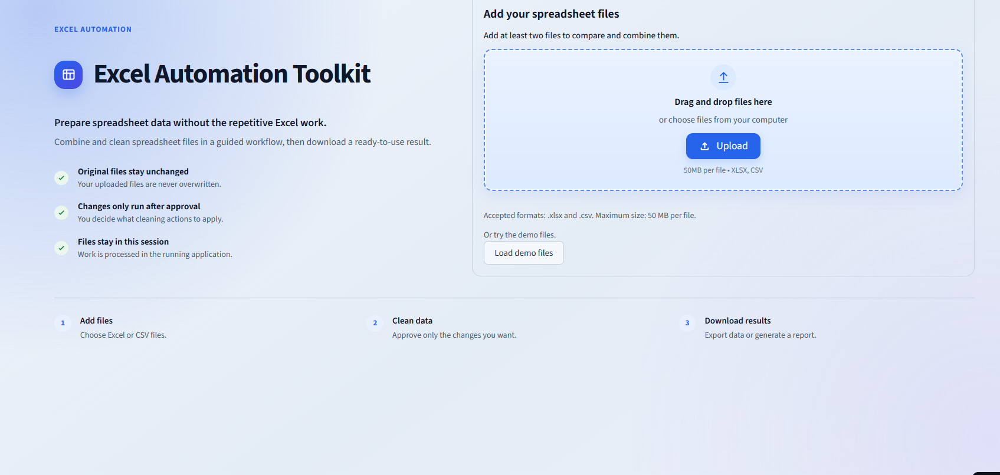
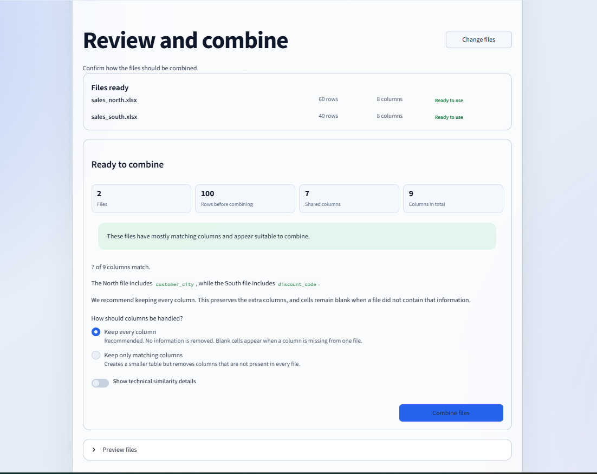
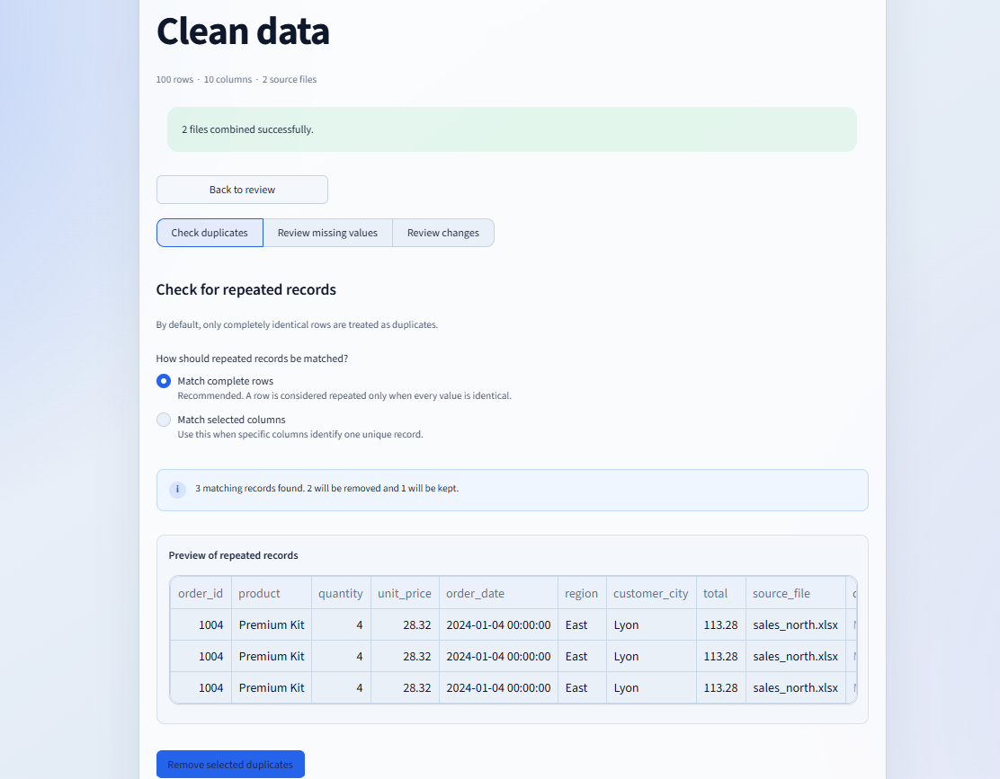
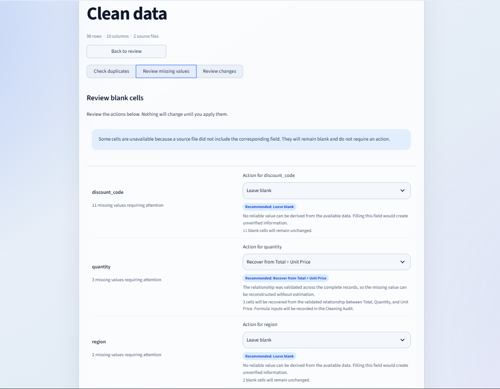
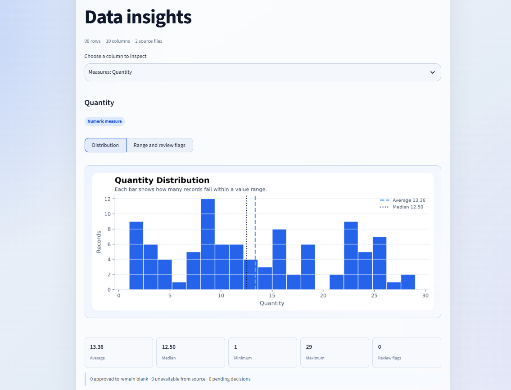
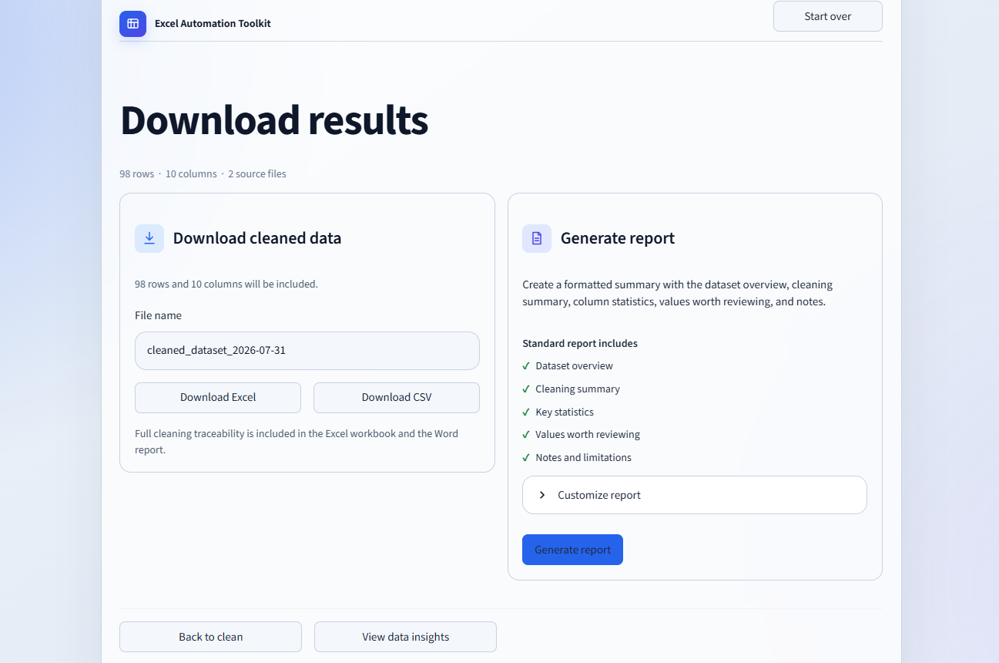

# Excel Automation Toolkit

A Streamlit app for combining, cleaning, reviewing, and exporting Excel and CSV files.

The goal is simple: make messy spreadsheet work easier without hiding what changed along the way.

[**Open the live demo**](https://excel-automation-toolkit-4grkxben6isuewsyosq7mn.streamlit.app/)

The demo includes sample files, so you can try the full workflow without preparing your own data.

<p align="center">
  <a href="https://excel-automation-toolkit-4grkxben6isuewsyosq7mn.streamlit.app/">
    
  </a>
</p>

## Overview

Combining spreadsheets is easy when every file has the same structure. In practice, that is rarely the case.

One file may contain columns that another does not. Records may be duplicated, values may be missing, and some blank cells may simply mean that a source never collected that field.

Excel Automation Toolkit helps review those differences before anything is changed. It combines the files, shows where the schemas differ, previews cleaning actions, and records every approved change.

## Key Features

- Upload and combine multiple Excel or CSV files
- Compare file structures before merging the data
- Keep track of which file each row came from
- Separate real missing values from fields a source never contained
- Review duplicate and missing-value actions before applying them
- Recover values from known relationships when possible
- Review statistics, unusual values, and integrity checks
- Export cleaned data, a cleaning audit, and a Word report

## How It Works

1. Upload two or more Excel or CSV files, or load the included demo data.
2. Compare the columns found in each file.
3. Choose whether to keep all columns or only the shared ones.
4. Review duplicates and missing values.
5. Apply only the cleaning actions you approve.
6. Download the cleaned data and supporting reports.

<details>
<summary><strong>View the complete workflow</strong></summary>

<br>

### 1. Review and combine

<p align="center">
  
</p>

### 2. Review duplicate records

<p align="center">
  
</p>

### 3. Handle missing values

<p align="center">
  
</p>

### 4. Explore Data Insights

<p align="center">
  
</p>

### 5. Download the results

<p align="center">
  
</p>

</details>

## More Than a Basic Spreadsheet Merge

A normal merge creates blank cells whenever one file contains a column that another file does not.

The problem is that those cells look exactly like genuine missing values, even though they mean something different. A blank value may mean that information is missing, or it may mean that the original file never contained that column at all.

The toolkit keeps the structure of each source file, so those cases can be handled separately. Values are not copied across unrelated files, and rows are not removed simply because one source lacked a column.

For genuine missing values, the app suggests conservative options. For example, when the data confirms a relationship such as:

`Total = Quantity × Unit Price`

a missing quantity can be calculated from:

`Total ÷ Unit Price`

That is a direct calculation from known values rather than a statistical guess. The formula, source file, record, and result are all added to the cleaning audit.

No cleaning action is applied until the user approves it.

## Example Use Case

Imagine two regional offices sending weekly sales spreadsheets.

One file contains `customer_city`, while the other contains `discount_code`. Both files also include a few duplicates and missing values.

The toolkit combines the files without dropping either column, guides the user through the cleaning decisions, and produces a final dataset that can be reviewed or shared.

## Output Files

### Excel workbook

The Excel export contains four sheets:

- `Cleaned Data`
- `Cleaning Summary`
- `Values to Review`
- `Cleaning Audit`

The audit includes the original value or state, the action taken, the method used, the source file, and the timestamp.

### CSV

The cleaned dataset can also be exported as a UTF-8 CSV file. A byte-order mark is included so non-English characters open correctly in common spreadsheet programs.

### Word report

The Word report includes:

- an executive summary
- dataset information
- a summary of the cleaning actions
- column statistics
- values that may need review
- methodology and limitations

Charts and a small data preview can be added optionally.

## Architecture

| Module | What it handles |
| --- | --- |
| `app.py`, `workflow.py` | Streamlit interface, navigation, and session state |
| `file_handler.py`, `data_processor.py` | File uploads, parsing, schema comparison, and combining |
| `data_quality.py`, `integrity.py` | Missing-value handling, audit records, and relationship checks |
| `analyzer.py`, `insights.py`, `visualizer.py` | Statistics, review flags, insights, and charts |
| `exporter.py`, `report_generator.py` | Excel, CSV, audit, and Word report generation |
| `ui_helpers.py`, `utils.py`, `logger_setup.py` | Shared helpers, formatting, and logging |

## Technology

- Python
- Streamlit
- pandas
- openpyxl
- Matplotlib
- python-docx
- pytest

Runtime dependencies are listed in `requirements.txt`.

## Running Locally

From PowerShell on Windows:

```powershell
git clone https://github.com/Sirius9841/excel-automation-toolkit.git
cd excel-automation-toolkit

python -m venv .venv
.venv\Scripts\activate

python -m pip install -r requirements.txt
streamlit run app.py
```

Run the tests:

```powershell
python -m pip install pytest
python -m pytest tests/ -v
```

Regenerate the sample files:

```powershell
python sample_data\generate_samples.py
```

Generate the example output files:

```powershell
python scripts\generate_business_ready_samples.py
```

The generated files are written to `output/`.

## Testing 

181 tests, all passing schema-aware merging, duplicate handling, missing-value decisions, source-aware replacements, deterministic recovery, integrity checks, exports, reports, and insights.

They cover:

- file and schema handling
- duplicate detection
- missing-value decisions
- source-aware replacements
- value recovery from known relationships
- integrity checks
- statistics and insights
- Excel and CSV exports
- Word reports
- workflow state

## Privacy

Uploaded files are processed in memory. The original files are never changed or overwritten.

The application logs basic operational information such as filenames, file sizes, row counts, and errors. Spreadsheet cell values are not written to the logs.

The code does not intentionally send uploaded data to analytics or other external services. Files uploaded to the live demo are processed on the hosted Streamlit server.

## Current Limitations

- Supports `.xlsx` and `.csv` files up to 50 MB
- Reads only the first worksheet from Excel files
- Requires at least two input files
- Combines rows rather than performing key-based joins
- Infers column meaning from names, data types, and value patterns
- Only the built-in `Total = Quantity × Unit Price` relationship is validated automatically
- Statistical replacements are estimates and should be reviewed
- Unusual values are review flags, not confirmed errors
- Database and cloud-storage imports are not currently supported
- The separate audit CSV is not exposed directly in the Streamlit interface

## Contact

- Email: [m.sigtermans44@gmail.com](mailto:m.sigtermans44@gmail.com)
- GitHub: [Sirius9841](https://github.com/Sirius9841)